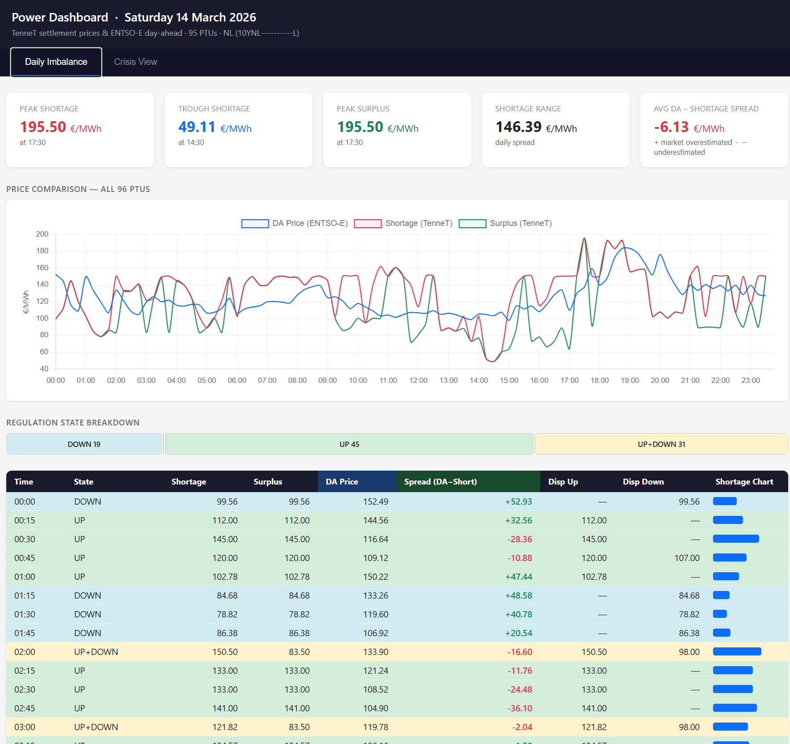
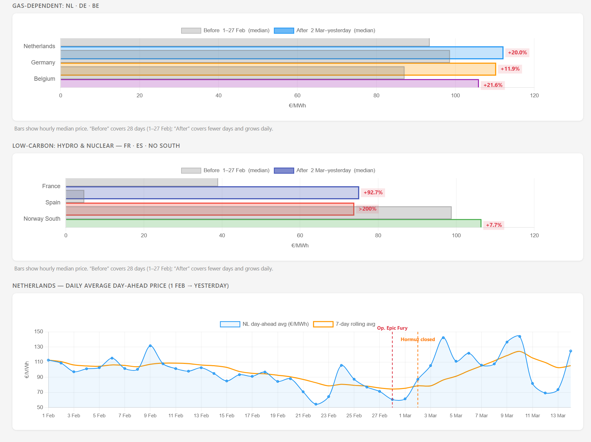

# NL Power Market Dashboard

A Claude Code skill and local web dashboard for monitoring 
Dutch short-term power market data in real time.

Built in a single session using Claude Code, with no prior 
coding experience. Powered by the TenneT and ENTSO-E 
Transparency Platform APIs.

 


---

## What it does

**Daily Imbalance tab**
- Fetches TenneT settlement prices for the Netherlands
- Displays all 95-96 PTUs (15-minute intervals) for any given day
- Shows regulation state per PTU: UP, DOWN, UP+DOWN, STABLE
- Shortage and surplus prices, dispatch prices, inline bar chart
- Summary statistics: max/min prices, delta, PTU count per state
- Notable moments flagged and interpreted by Claude automatically

**Crisis View tab**
- Compares European day-ahead wholesale electricity prices 
  before and after Operation Epic Fury (28 Feb 2026) and the 
  Strait of Hormuz closure (2 Mar 2026)
- Countries grouped by grid type: gas-dependent (NL, DE, BE) 
  vs low-carbon hydro & nuclear (FR, ES, NO)
- Before/after bar chart with percentage change per country
- Netherlands daily price trajectory from 1 Feb to present, 
  with 7-day rolling average and event markers

---

## Data sources

| Source | Data | Auth |
|--------|------|------|
| [TenneT API](https://developer.tennet.eu) | Settlement prices, regulation state, dispatch prices | API token (free, registration required) |
| [ENTSO-E Transparency Platform](https://transparency.entsoe.eu) | Day-ahead prices, all bidding zones | API token (free, registration required) |

---

## Context

The Crisis View was built during the 2026 Strait of Hormuz 
crisis, triggered by US-Israeli strikes on Iran on 28 February 
2026 and the subsequent effective closure of the strait by 
Iran's IRGC on 2 March. The closure disrupted approximately 
20% of global oil supply and sent European gas and electricity 
prices sharply higher.

The Netherlands, as a gas-dependent grid, showed a +15% 
increase in average day-ahead prices in the two weeks 
following the event compared to February. The dashboard 
makes this visible in the data.

---

## How to run it

**Prerequisites**
- Python 3
- A TenneT API token (register at developer.tennet.eu)
- An ENTSO-E API token (register at transparency.entsoe.eu)

**Setup**
```bash
